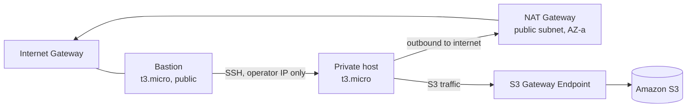

# Multi-AZ VPC with an S3 Gateway Endpoint

A Terraform lab: a VPC across two Availability Zones with public and private
subnets, a bastion as the only SSH path into the private tier, and an S3 gateway
endpoint so traffic to S3 leaves through the private route table instead of the
NAT Gateway.

The part worth reading is [troubleshooting.md](troubleshooting.md): five failures
I hit deploying this, each with the error message, the root cause and the fix.
The state mismatch in section 3 is the one that cost me the most, and the reason
it cost money is in there too.

## Architecture



| Layer | What it is |
| :--- | :--- |
| VPC | `10.0.0.0/16`, DNS hostnames on |
| Public subnets | 2, one per AZ, `10.0.1.0/24` and `10.0.2.0/24`, routed to the Internet Gateway |
| Private subnets | 2, one per AZ, `10.0.10.0/24` and `10.0.11.0/24`, routed to the NAT Gateway |
| Bastion | `t3.micro` in a public subnet, SSH restricted to `var.admin_cidr` |
| Private host | `t3.micro` in a private subnet, SSH only from the bastion security group |
| S3 access | Gateway endpoint attached to the private route table |

## The one decision worth explaining

Everything a private instance sends to the internet goes through the NAT
Gateway, and the NAT Gateway bills for every gigabyte it processes. S3 traffic
does not have to go that way.

A gateway endpoint injects an AWS-managed prefix list into the private route
table, so packets addressed to S3 in this region are routed to the endpoint
instead of to the NAT. Three things follow. The traffic stops incurring NAT
data-processing charges — a gateway endpoint has no hourly and no per-gigabyte
charge of its own. It never touches the public internet, so it stays on the AWS
backbone. And because the route is decided in the route table, no instance
configuration changes: the same `aws s3 cp` takes the new path without knowing
about it.

The security groups are chained rather than repeated. The bastion accepts SSH
from one operator CIDR passed in as a variable; the private host accepts SSH
only from the bastion's security group ID, not from a CIDR block. That way the
private tier keeps working when the operator's IP changes and nothing has to be
edited in two places.

## What this is not

Stated plainly, because the diagram looks more production-ready than it is.

**There is one NAT Gateway, in one Availability Zone**, and a single private
route table pointing both private subnets at it. If that AZ fails, both private
subnets lose outbound connectivity. The network is multi-AZ; its outbound path
is not. The fix is one NAT Gateway per AZ with a route table each, which roughly
doubles the NAT bill — a deliberate trade for a lab.

**There is no load balancer, no Auto Scaling group and no database.** This is
the network layer plus two hosts that exist to prove the paths work: SSH into
the bastion, jump to the private host, reach S3 from it, confirm the traffic did
not go through the NAT.

**Nothing runs on the instances.** They are `t3.micro` test hosts.

## Deploy

```bash
cp terraform.tfvars.example terraform.tfvars   # set admin_cidr and key_name
terraform init
terraform plan
terraform apply
```

`admin_cidr` is your workstation's public IP in CIDR form — `curl ifconfig.me`
gives it. `key_name` is an existing EC2 key pair **in `us-east-1`**; key pairs
are per-region, which is the first entry in the troubleshooting log.

Destroy it when you are done. The NAT Gateway bills by the hour whether or not
anything is using it.

```bash
terraform destroy
```
